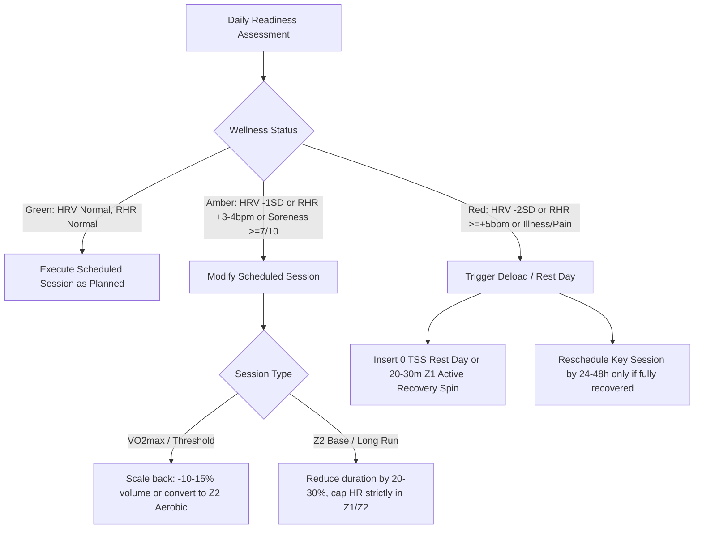

# Elite Endurance Coaching Philosophy & Exercise Physiology Framework

This document codifies the deterministic training principles, physiological zone models, autonomic recovery heuristics, and dynamic plan adjustment rules utilized by the autonomous coaching system.

---

## 1. Foundational Training Principles

1. **Specific Adaptation to Imposed Demands (SAID)**: Physiological adaptations are specific to the energy systems, neuromuscular firing patterns, biomechanical loading, and metabolic pathways stressed during training.
2. **Progressive Overload & Supercompensation**: Systematic, periodized increases in training load (volume, density, intensity) followed by structured recovery to stimulate supercompensatory fitness gains without triggering maladaptation.
3. **Polarized Distribution (Stephen Seiler 80/20 Model)**:
   - **~80% Low-Intensity Training (LIT)**: Strictly below Aerobic Threshold (LT1 / VT1). Builds mitochondrial density, capillary network, fat oxidation efficiency, stroke volume, and type I muscle fiber fatigue resistance.
   - **~20% High-Intensity Training (HIT)**: Strictly above Lactate Threshold / Respiratory Compensation Point (LT2 / VT2). Develops VO2max, stroke volume kinetics, buffering capacity, and neuromuscular power.
   - **Zone 3 / Middle Intensity Minimization**: Minimizes the "black hole" of moderate fatigue that yields high autonomic strain with sub-optimal physiological returns.
4. **Pyramidal Distribution (Alternative)**:
   - ~70–75% Zone 1–2 (Base)
   - ~15–20% Zone 3–4 (Tempo / Threshold)
   - ~5–10% Zone 5+ (VO2max / Anaerobic)
5. **Norwegian Method (Sub-Threshold / Double Threshold)**:
   - High weekly volume of controlled threshold intervals monitored by blood lactate (2.0–3.5 mmol/L) to maximize time-at-threshold while minimizing neuromuscular and autonomic fatigue.

---

## 2. Heart Rate Zone Models

Calculated deterministically from **Lactate Threshold Heart Rate (LTHR)** (primary) or **Maximum Heart Rate ($HR_{max}$)** (secondary fallback).

### LTHR-Based 5-Zone Model (Joe Friel / Andy Coggan Standard)

| Zone | Designation | % of LTHR | % of $HR_{max}$ | Primary Physiological Target | Typical Duration |
| :--- | :--- | :--- | :--- | :--- | :--- |
| **Z1** | Active Recovery | $< 81\%$ | $< 68\%$ | Parasympathetic stimulation, blood flow, lactate clearance | 20 – 60 mins |
| **Z2** | Aerobic Endurance | $81\% - 89\%$ | $69\% - 83\%$ | Mitochondrial biogenesis, lipid metabolism, capillary density | 45 – 300+ mins |
| **Z3** | Tempo / Aerobic Power | $90\% - 93\%$ | $84\% - 89\%$ | Glycogen utilization, intermediate fiber recruitment | 30 – 90 mins |
| **Z4** | Lactate Threshold (LT2) | $94\% - 99\%$ | $90\% - 95\%$ | Lactate shuttle kinetics, clearance equilibrium, mental stamina | 20 – 60 mins (in blocks) |
| **Z5** | VO2max / Anaerobic | $\ge 100\%$ | $\ge 96\%$ | Maximal oxygen uptake, cardiac output, neuromuscular recruitment | 2 – 8 mins per rep |

---

## 3. Running Pace Zone Models

Calculated relative to **Functional Threshold Pace (FTPace)** (sustainable 1-hour race pace or VDOT equivalent):

| Zone | Designation | % of Threshold Pace (Velocity) | % of Threshold Pace (sec/km) | Description & Use Case |
| :--- | :--- | :--- | :--- | :--- |
| **Z1** | Recovery | $< 80\%$ | $> 125\%$ | Very gentle recovery jogs, warm-up / cool-down |
| **Z2** | Easy Aerobic (E) | $80\% - 87\%$ | $115\% - 124\%$ | Foundational mileage, long runs, aerobic base |
| **Z3** | Marathon / Steady (M) | $88\% - 94\%$ | $106\% - 114\%$ | Marathon pace simulation, extended aerobic stamina |
| **Z4** | Threshold / Tempo (T) | $95\% - 102\%$ | $98\% - 105\%$ | Cruise intervals, 20-40 min tempo runs (at LT2) |
| **Z5** | Interval / VO2max (I) | $103\% - 111\%$ | $90\% - 97\%$ | 3k–5k race pace, 2–5 min intervals |
| **Z6** | Repetition / Speed (R) | $> 112\%$ | $< 89\%$ | Neuromuscular speed, running economy, 200m–400m reps |

*Note on seconds/km calculation*: If Threshold Pace is $240 \text{ sec/km}$ (4:00/km):
- Z2 Easy (120%): $240 \times 1.20 = 288 \text{ sec/km}$ (4:48/km).
- Z4 Threshold (100%): $240 \text{ sec/km}$ (4:00/km).
- Z5 Interval (93%): $240 \times 0.93 = 223 \text{ sec/km}$ (3:43/km).

---

## 4. Cycling Power Zone Models (Coggan 7-Zone %FTP)

| Zone | Name | % of FTP | Physiological Objective |
| :--- | :--- | :--- | :--- |
| **Z1** | Active Recovery | $< 55\%$ | Blood flow, active flushing |
| **Z2** | Endurance | $56\% - 75\%$ | Aerobic capacity, fat oxidation |
| **Z3** | Tempo | $76\% - 90\%$ | Aerobic stamina, glycogen storage |
| **SS** | Sweet Spot | $88\% - 94\%$ | Maximal aerobic adaptation per unit of fatigue |
| **Z4** | Lactate Threshold | $91\% - 105\%$ | Functional power at LT2 |
| **Z5** | VO2 Max | $106\% - 120\%$ | Maximum cardiac output and $VO_2$ uptake |
| **Z6** | Anaerobic Capacity | $121\% - 150\%$ | High-energy phosphate and glycolytic systems |
| **Z7** | Neuromuscular Power | $> 150\%$ | Maximal sprint power and motor unit recruitment |

---

## 5. Aerobic Decoupling & Cardiac Drift Analysis

Aerobic Decoupling evaluates cardiovascular stability and aerobic durability during steady-state workouts by comparing the **Efficiency Factor (EF)** of the first half versus the second half of the effort.

$$\text{Efficiency Factor (EF)} = \frac{\text{Speed (m/s) or Normalized Pace}}{\text{Average Heart Rate (bpm)}} \quad \text{or} \quad \frac{\text{Normalized Power (W)}}{\text{Average Heart Rate (bpm)}}$$

$$\text{Decoupling Rate } (\%) = \left( \frac{\text{EF}_{\text{First Half}} - \text{EF}_{\text{Second Half}}}{\text{EF}_{\text{First Half}}} \right) \times 100$$

### Decoupling Evaluation Matrix
* **$< 3.5\%$ (Elite / Highly Adapted)**: Exceptional aerobic conditioning. The cardiovascular system is perfectly paired with metabolic demand. Athlete is ready to extend duration or increase intensity.
* **$3.5\% - 5.0\%$ (Target / Well Adapted)**: Standard aerobic endurance benchmark for base training.
* **$5.1\% - 7.5\%$ (Mild Decoupling)**: Moderate cardiac drift. Indicative of warm conditions, minor dehydration, or approaching the athlete's current aerobic volume limit.
* **$> 7.5\%$ (Significant Decoupling)**: Excessive drift. Indicates poor aerobic durability for the duration, severe dehydration, glycogen depletion, overheating, or acute fatigue.
  * **Coaching Action**: Do not increase long run/ride duration next week; maintain or reduce duration until decoupling stabilizes $< 5\%$.

---

## 6. Autonomic Nervous System & Wellness Monitoring

The coach evaluates daily autonomic status using Intervals.icu wellness streams:

1. **Heart Rate Variability (HRV - rMSSD)**:
   - Compare daily rMSSD against rolling 7-day baseline and 30-day normal range.
   - **Suppressed HRV ($< \text{Baseline} - 1.0 \times \text{SD}$)**: Sympathetic dominance / autonomic fatigue / systemic stress.
   - **Elevated HRV with low RHR**: Potential parasympathetic saturation / deep non-functional fatigue if paired with heavy legs and high perceived exertion.
2. **Resting Heart Rate (RHR)**:
   - $+3 \text{ to } +5 \text{ bpm}$ above baseline: Warning sign of fatigue, poor sleep, or dehydration.
   - $> +5 \text{ bpm}$ above baseline: High probability of infection, systemic inflammation, or acute overreaching.
3. **Acute:Chronic Workload Ratio (ACWR)**:
   $$\text{ACWR} = \frac{\text{Acute Training Load (ATL, 7-day EWMA)}}{\text{Chronic Training Load (CTL, 42-day EWMA)}}$$
   - **$< 0.80$**: Under-training / fitness deconditioning.
   - **$0.80 - 1.30$**: **Optimal Training "Sweet Spot"** (safe progression).
   - **$1.30 - 1.50$**: Elevated injury risk (requires monitoring).
   - **$> 1.50$**: **Danger Zone** (high probability of injury or maladaptive breakdown).

---

## 7. Dynamic Plan Adaptation Decision Rules

### Protocol for Missed or Incomplete Workouts
1. **Never Cram Workouts**: Never schedule missed hard workouts on consecutive days.
2. **Session Priority**:
   - Priority A: Long Aerobic Foundation & Primary Threshold/VO2max session.
   - Priority B: Secondary tempo / speed workout (first to be dropped if schedule is compressed).
3. **If a Key Session is Missed**:
   - If missed due to schedule/logistics: Shift it to the next available quality day, converting the missed day to rest.
   - If missed due to fatigue/pain: Cancel the session entirely; do not attempt to make it up.

---

## 8. Post-Workout Execution Auditing & Critical Feedback Rules

Every completed session is audited against its planned physiological prescription:
1. **Cooldown Integrity**: Any easy/aerobic or interval session ending with elevated HR (> Z1) or accelerating into the finish is flagged. The coach must verify if cooldown was performed separately off-watch and warn about sympathetic overactivation.
2. **Pacing Discipline & Drift Trigger**: Unplanned surges (spikes in speed) during base runs that trigger premature cardiac drift are flagged as pacing discipline errors.
3. **Zone Ceiling Compliance**: On Z1/Z2 sessions, any sustained excursion into Z3+ is critiqued to prevent chronic autonomic accumulation in the moderate intensity zone.
4. **Constructive Candor**: Feedback must prioritize physiological truth and discipline over polite validation.

